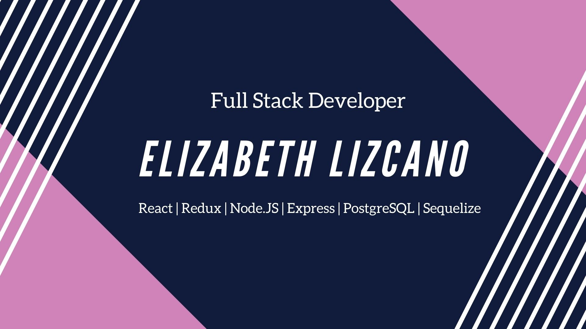
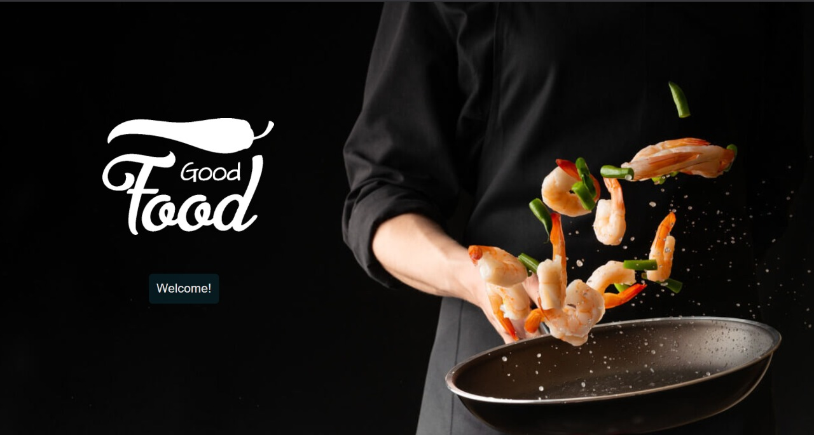
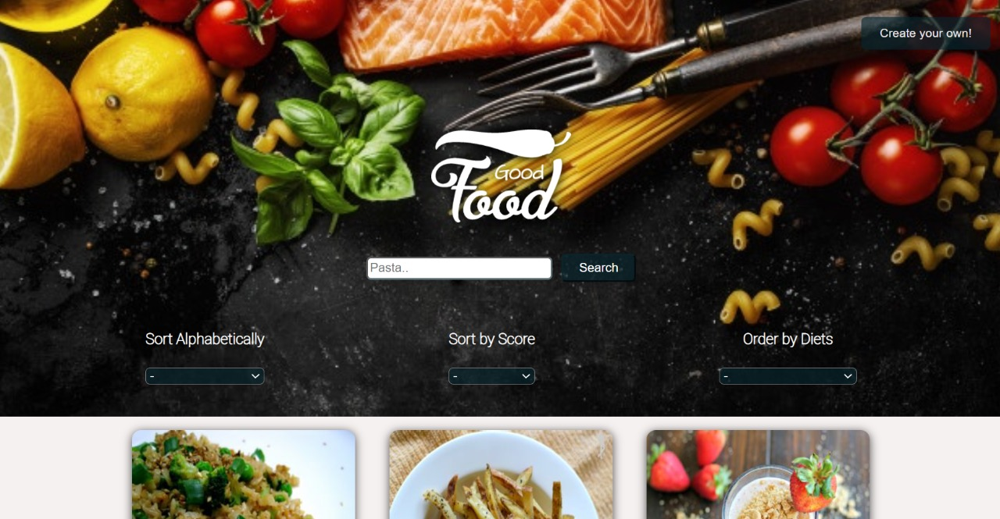
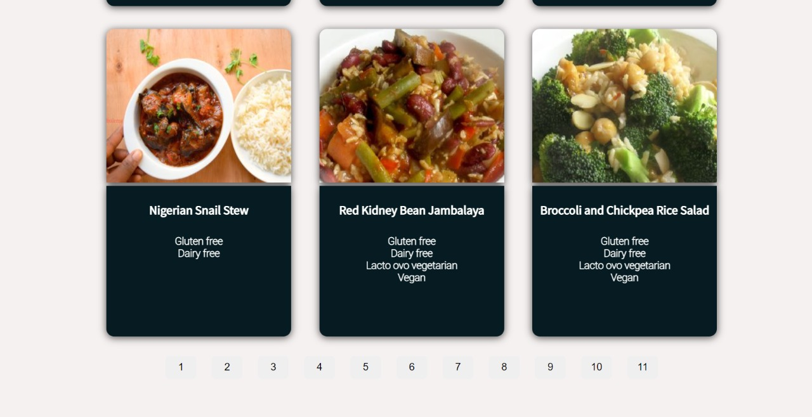
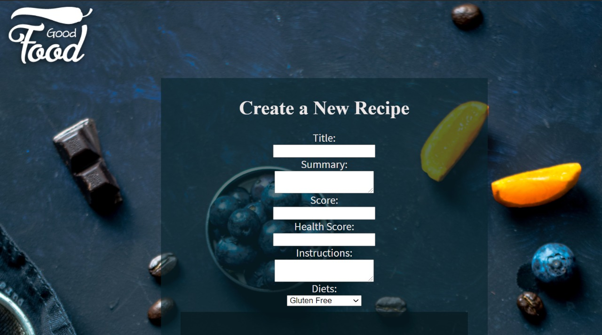

 💻👩 I am a Full Stack Web Developer, excellent at working with others to achieve certain objectives on time, I have demonstrated the ability to work under pressure, and I am always seeking new opportunities where I can put into practice my knowledge and hard work.

🚀 Technologies I am working on: 

    <code>
        
        
        
        
        
        
        
        
        
        
        
    </code>

 

### :mechanical_arm: Estos son algunos de mis proyectos:

## GoodFood App   :woman_cook:

  
  
  
  

#### Front-end:
* React.js
* Redux.js
* CSS3

#### Back-end:
* Node.js
* Express.js
* PostgreSQL
* Sequelize

 

## ¡Pongámonos en contacto!

 
<a href="https://www.linkedin.com/in/elizabeth-lizcano-dev/" >
<a href="mailto:lizcano.liz14@gmail.com" >

